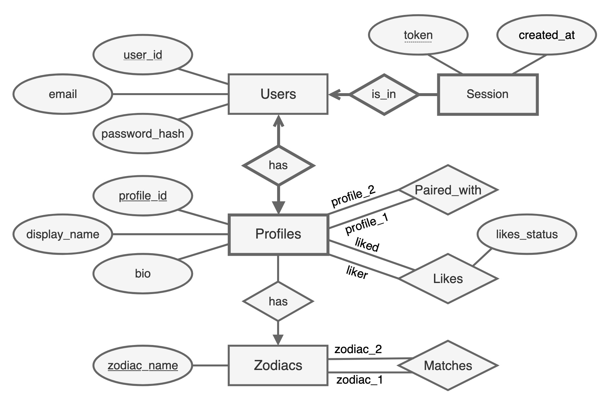

### Overview
This project is a dating app where users are matched based on their zodiac signs. The backend is built with FastAPI and Python, and interacts with a PostgreSQL database via SQL.

#### Database model

### Getting Started
#### Prerequisites
- Python with uv installed
- Rust with cargo installed
- The dioxus cli installed (can be installed by running 'cargo install dioxus-cli')
- PostgreSQL installed and running

#### Setup and Running
1. Navigate to the project folder in the terminal
2. Run: `chmod +x setup.sh`
3. Run: `./setup.sh`
4. Run: `uv run fastapi dev main.py`
5. Navigate to the /frontend/ folder
6. Run:  rustup target add wasm32-unknown-unknown
7. Run: dx serve
8. Open http://127.0.0.1:8080/ in your browser

#### Test Account
To try the app please log in as Bente:
- Email: `bente_1@mail.com`
- Password: `password1`
